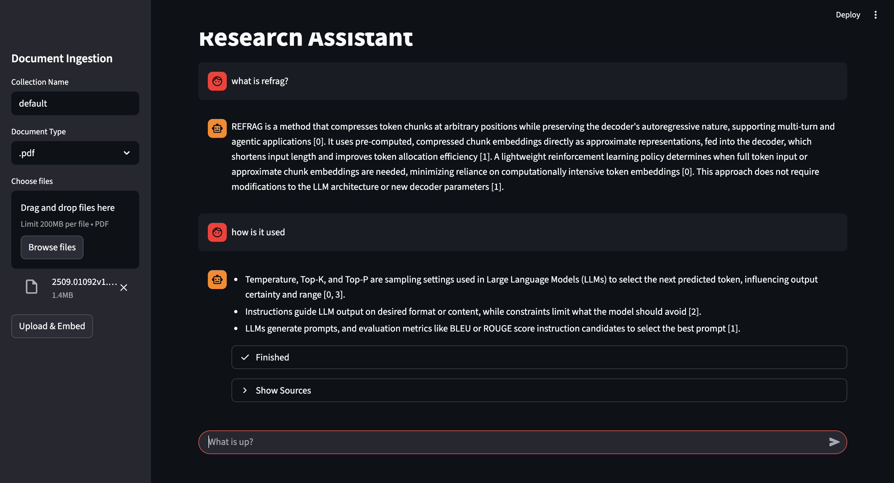
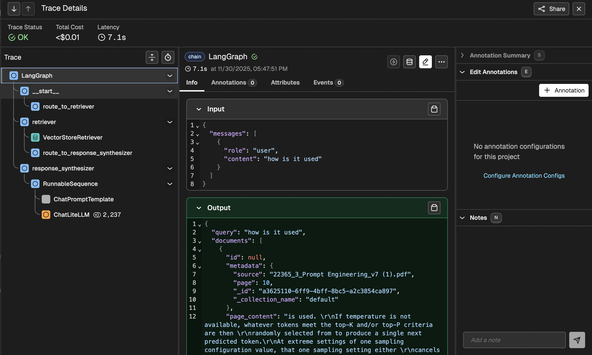
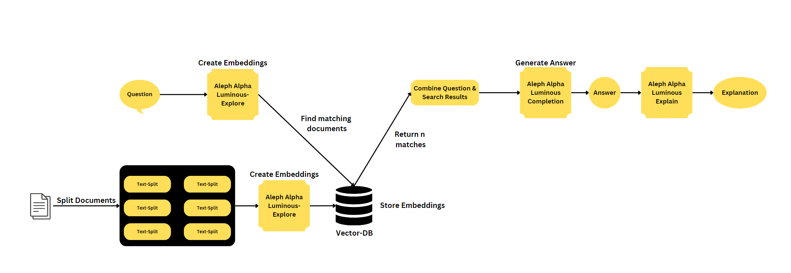

[](https://github.com/astral-sh/ruff)
<a href="https://github.com/psf/black"></a>

# Conversational RAG Agent
This is a Rest-Backend for a Conversational Agent, that allows you to embed Documents, search for them using Semantic Search, to QA based on Documents and do document processing with Large Language Models.




## Table of Contents
- [Conversational RAG Agent](#conversational-rag-agent)
  - [Table of Contents](#table-of-contents)
  - [LLMs and Backend Providers](#llms-and-backend-providers)
  - [Quickstart](#quickstart)
  - [Project Description](#project-description)
  - [What is RAG?](#what-is-rag)
  - [Tracing](#tracing)
  - [Semantic Search](#semantic-search)
    - [Hybrid Search](#hybrid-search)
  - [Architecture](#architecture)
  - [Installation \& Development Backend](#installation--development-backend)
    - [Load Demo Data](#load-demo-data)
  - [Development Frontend](#development-frontend)
  - [Qdrant API Key](#qdrant-api-key)
  - [Testing the API](#testing-the-api)
  - [Star History](#star-history)


## LLMs and Backend Providers

I have decided to stop creating different services for different provider and switching to LiteLLM which allows to use basically every provider you want.

Some providers i would recommend are:

- [Cohere](https://cohere.com/) Awesome models and great free tier.
- [Ollama](https://ollama.com/) If you want to keep your data your data.
- [Google AI Studio](https://aistudio.google.com) The Google Integration that is not really suited for enterprise but perfect for everybody else.

> [!NOTE]
> The `EmbeddingManagement` class in `src/agent/backend/services/embedding_management.py` contains placeholders for Google and OpenAI embedding providers. These are intended as extension points for you to implement if you wish to use these specific providers directly.


## Quickstart
To run the complete system with docker use this command:

```bash
git clone https://github.com/mfmezger/conversational-agent-langchain.git
cd conversational-agent-langchain
```


Create a .env file from the `template.env` and set the necessary API Keys.
Absolutely necessary are:
- GEMINI_API_KEY
- COHERE_API_KEY


Then start the system with
```bash
  docker compose up -d
```

| Service               | URL                               |
| --------------------- | --------------------------------- |
| **API Documentation** | `http://127.0.0.1:8001/docs`      |
| **Frontend**          | `http://localhost:8501`           |
| **Qdrant Dashboard**  | `http://localhost:6333/dashboard` |
| **Phoenix Dashboard** | `http://localhost:6006`           |


## Project Description
This project is a conversational rag agent that uses Google Gemini Large Language Models to generate responses to user queries. The agent also includes a vector database and a REST API built with FastAPI.

## What is RAG?
Retrieval-Augmented Generation (RAG) is a technique that enhances Large Language Models (LLMs) by providing them with relevant information from an external knowledge base. Instead of relying solely on its pre-trained knowledge, the model retrieves specific documents related to the user's query and uses them as context to generate more accurate, up-to-date, and domain-specific responses. This approach reduces hallucinations and allows the model to answer questions about private or proprietary data.


Features
- Uses Large Language Models to generate responses to user queries.
- Includes a vector database to store and retrieve information.
- Provides a REST API built with FastAPI for easy integration with other applications.
- Has a basic GUI.
- Includes Phoenix Tracing for observability.
- **Reranking support** with Cohere and FlashRank providers.

## Reranking Configuration

Reranking improves retrieval quality by re-scoring documents after initial retrieval. Two providers are supported:

| Provider    | Description                                   | Requires API Key       |
| ----------- | --------------------------------------------- | ---------------------- |
| `cohere`    | Cohere Rerank API (cloud-based, high quality) | Yes (`COHERE_API_KEY`) |
| `flashrank` | FlashRank (local, fast, privacy-friendly)     | No                     |
| `none`      | Disabled (default)                            | No                     |

Add these to your `.env` file:

```bash
# Reranking
RERANK_PROVIDER=cohere          # Options: "cohere", "flashrank", "none"
RERANK_TOP_K=5                  # Number of documents to keep after reranking

# Retrieval
RETRIEVAL_K=10                  # Documents to retrieve initially
RETRIEVAL_K_RETRY=20            # Documents to retrieve on retry
```

> [!TIP]
> For best results, set `RETRIEVAL_K` higher than `RERANK_TOP_K` so the reranker has more candidates to choose from.

## Tracing
This project uses [Phoenix](https://github.com/Arize-AI/phoenix) for tracing and observability. It allows you to monitor the execution of your RAG pipeline, inspect retrieved documents, and debug the generation process.




## Semantic Search


Semantic search is an advanced search technique that aims to understand the meaning and context of a user's query, rather than matching keywords. It involves natural language processing (NLP) and machine learning algorithms to analyze and interpret user intent, synonyms, relationships between words, and the structure of content. By considering these factors, semantic search improves the accuracy and relevance of search results, providing a more intuitive and personalized user experience.

### Hybrid Search

For Hybrid Search the BM25 FastEmbed from Qdrant is used.

## Architecture


## Installation & Development Backend

On Linux or Mac you need to adjust your /etc/hosts file to include the following line:

```bash
127.0.0.1 qdrant
```

First install Python Dependencies:

You need to install uv if you want to use it for syncing the requirements.lock file. [UV Installation](https://docs.astral.sh/uv/getting-started/installation/).

```bash
uv sync
```

### Load Demo Data

In src/agent/scripts use the load dummy data script to load some example data in the rag.


Start the complete system with:

```bash
docker compose up -d
```

To run the Qdrant Database local just run:

```bash
docker compose up qdrant
```


To run the Backend use this command in the root directory:

```bash
uv run uvicorn agent.api:app --reload
```
```

To run the tests you can use this command:

```bash
uv run coverage run -m pytest -o log_cli=true -vvv tests
```

## Development Frontend

To run the Frontend use this command in the root directory:

```bash
uv run streamlit run frontend/assistant.py --theme.base="dark"
```


## Qdrant API Key
To use the Qdrant API you need to set the correct parameters in the .env file.
QDRANT_API_KEY is the API key for the Qdrant API.
And you need to change it in the qdrant.yaml file in the config folder.


## Testing the API
To Test the API i would recommend [Bruno](https://www.usebruno.com/). The API Requests are store in ConvAgentBruno folder.


## Star History

<a href="https://star-history.com/#mfmezger/conversational-agent-langchain&Date">
  <picture>
    <source media="(prefers-color-scheme: dark)" srcset="https://api.star-history.com/svg?repos=mfmezger/conversational-agent-langchain&type=Date&theme=dark" />
    <source media="(prefers-color-scheme: light)" srcset="https://api.star-history.com/svg?repos=mfmezger/conversational-agent-langchain&type=Date" />
    
  </picture>
</a>
