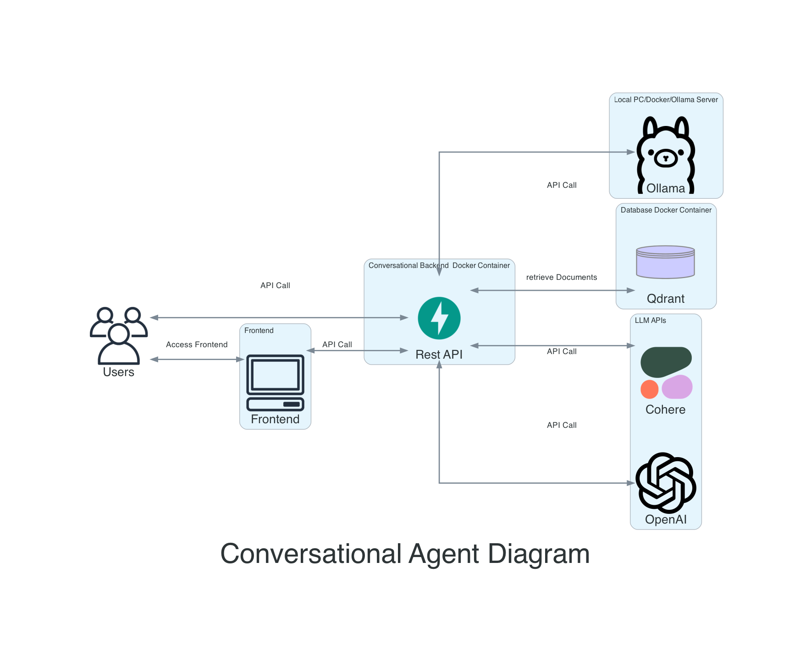

# Conversational Agent
This is a Backend to chat with your Data with Semantic Search.


- [Conversational Agent](#conversational-agent)
  - [Project Description](#project-description)
  - [Architecture Semantic Search](#architecture-semantic-search)
  - [Components](#components)
  - [Deployment](#deployment)
  - [Secret Management](#secret-management)
  - [Installation \& Development Backend](#installation--development-backend)
  - [Development Frontend](#development-frontend)


## Project Description
This project is a conversational agent that uses Aleph Alpha and OpenAI Large Language Models to generate responses to user queries. The agent also includes a vector database and a REST API built with FastAPI.

Features
- Uses Aleph Alpha and OpenAI Large Language Models to generate responses to user queries.
- Includes a vector database to store and retrieve information.
- Provides a REST API built with FastAPI for easy integration with other applications.
- Has a basic gui.

## Architecture Semantic Search


Semantic search is an advanced search technique that aims to understand the meaning and context of a user's query, rather than matching keywords. It involves natural language processing (NLP) and machine learning algorithms to analyze and interpret user intent, synonyms, relationships between words, and the structure of content. By considering these factors, semantic search improves the accuracy and relevance of search results, providing a more intuitive and personalized user experience.

## Components

Langchain is a library for natural language processing and machine learning. FastAPI is a modern, fast (high-performance) web framework for building APIs with Python 3.7+ based on standard Python type hints. A Vectordatabase is a database that stores vectors, which can be used for similarity searches and other machine learning tasks.

## Deployment

If you want to use a default token for the LLM Provider you need to create a .env file. Do this by copying the .env-template file and add the necessary api keys.

If you are working in an envoironment with internet connection the easiest way is to use this command:

```bash
docker compose -f docker-compose-hub.yml up
```

This will pull the image from docker hub and run it. Instead of building it on your local machine.

If you want to build the image on your local machine you can use this command:

```bash
docker compose up
```

## Secret Management

Two ways to manage your api keys are available, the easiest approach is to sent the api token in the request as the token.
Another possiblity is to create a .env file and add the api token there.
If you use OpenAI from Azure or OpenAI directly you need to set the correct parameters in the .env file.


## Installation & Development Backend

First install Python Dependencies:

```bash
pip install poetry
poetry install
```

To run the Backend use this command in the root directory:

```bash
poetry run uvicorn agent.api:app --reload
```

To run the tests you can use this command:

```bash
poetry run coverage run -m pytest -o log_cli=true -vvv tests
```

## Development Frontend

To run the Frontend use this command in the root directory:

```bash
poetry run streamlit run gui.py
```


<!-- ## Star History

<a href="https://star-history.com/#mfmezger/conversational-agent-langchain&Date">
  <picture>
    <source media="(prefers-color-scheme: dark)" srcset="https://api.star-history.com/svg?repos=mfmezger/conversational-agent-langchain&type=Date&theme=dark" />
    <source media="(prefers-color-scheme: light)" srcset="https://api.star-history.com/svg?repos=mfmezger/conversational-agent-langchain&type=Date" />
    
  </picture>
</a> -->
